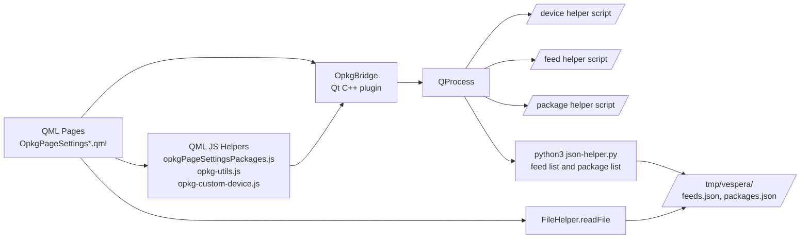
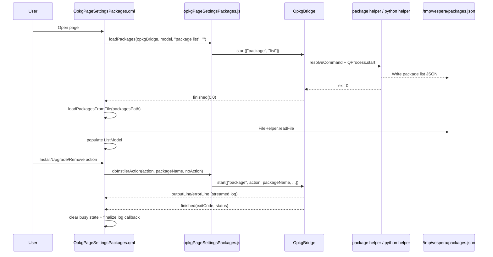
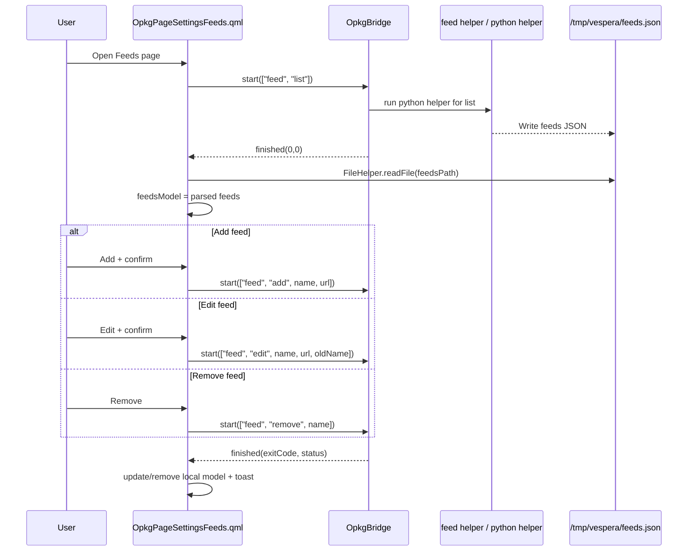
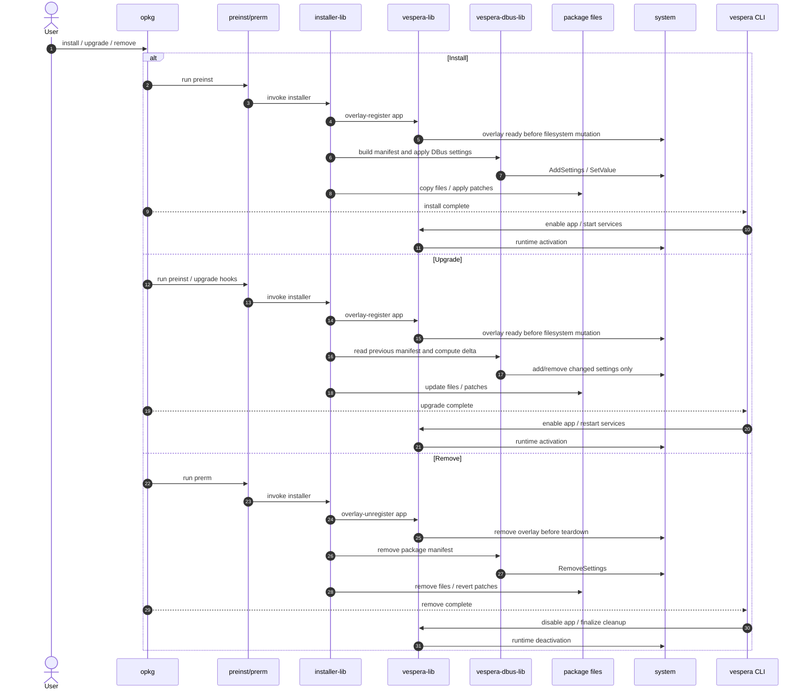
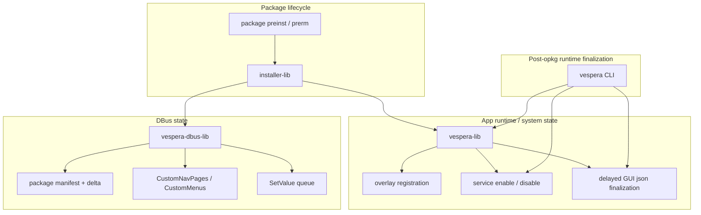
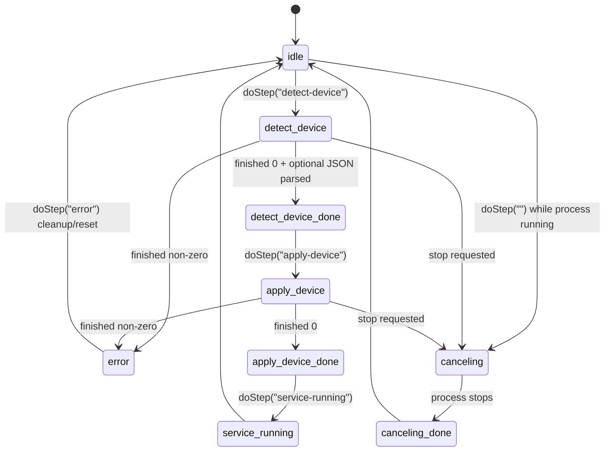

# vespera Mermaid diagrams

This document captures code-level flows for the vespera addon.

Related: [Installer Integration Patterns (Developer Note)](installer-integration-patterns.md)

## 1) High-level architecture

## 2) Package list/install/upgrade/remove flow

## 3) Feed management flow

## 4) Install / upgrade / remove lifecycle

This sequence intentionally separates concerns:
- `installer-lib` handles package lifecycle orchestration
- `vespera-lib` owns overlay and runtime activation/deactivation
- `vespera-dbus-lib` owns package DBus state and upgrade deltas
- the `vespera` CLI performs post-opkg runtime finalization only

## 5) Responsibility map

This map makes the intended boundary explicit:
- package lifecycle actions are triggered by the installer path
- overlay and runtime activation belong to `vespera-lib`
- DBus package state belongs to `vespera-dbus-lib`
- final app enablement post-opkg belongs to the CLI path only

## 6) Device setup step state machine

## Source anchors

- [src/opt/victronenergy/gui/qml/OpkgPageSettingsPackages.qml](../src/opt/victronenergy/gui/qml/OpkgPageSettingsPackages.qml)
- [src/opt/victronenergy/gui/qml/opkgPageSettingsPackages.js](../src/opt/victronenergy/gui/qml/opkgPageSettingsPackages.js)
- [src/opt/victronenergy/gui/qml/OpkgPageSettingsFeeds.qml](../src/opt/victronenergy/gui/qml/OpkgPageSettingsFeeds.qml)
- [src/opt/victronenergy/gui/qml/OpkgPageSettingsDeviceSetup.qml](../src/opt/victronenergy/gui/qml/OpkgPageSettingsDeviceSetup.qml)
- [src/qmlplugin/OpkgBridge.cpp](../src/qmlplugin/OpkgBridge.cpp)
- [src/data/apps/vespera/service-commands/json-helper.py](../src/data/apps/vespera/service-commands/json-helper.py)